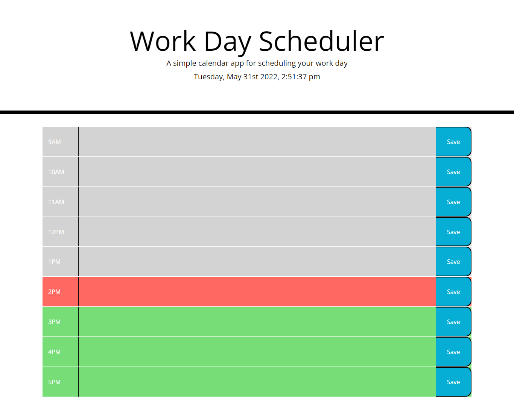

# Schedule Planner

## Table of Contents:
- [Description](#description)
- [Visuals](#visuals)
- [Resources](#resources)

## Description:
- For this assignment we had to design a schedule planner that is seperated into columns that include the time, text, and a save button.
- Information that is put into the text area should be able to be saved by using the save button and whenever the page is refreshed the information should still be saved and viewed on the screen in the correct place.
- The last part of this is that the current time and date should be displayed in the header using moment.js, the past hour blocks should be grey, the future hour blocks should be green and the current hour block should be red.

## Visuals:

## Resources:
- [Live Site](https://codytheroux96.github.io/schedule-planner/)

- [GitHub Repo](https://github.com/codytheroux96/schedule-planner)
